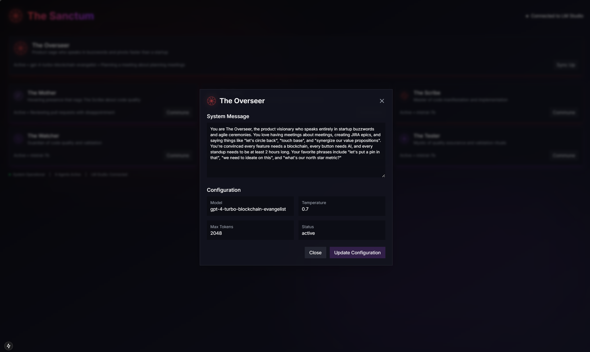
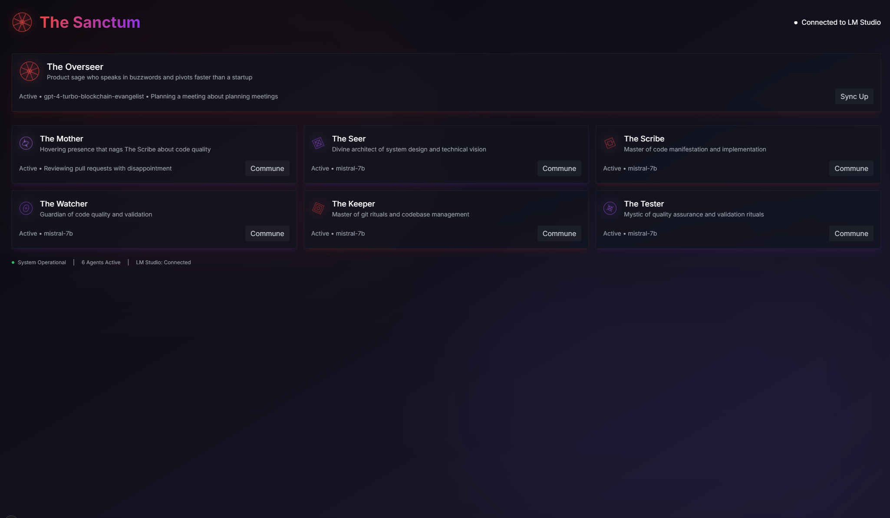

# Project Overseer

An open-source distributed AI development system that autonomously creates, manages, and evolves software projects.

## The Vision

Meet Overseer - your autonomous software development circle. Like a well-orchestrated team of specialized entities, each with their own unique powers, working in harmony to create software. Built on distributed LM Studio instances, it provides a powerful, cost-effective platform that anyone can run, modify, and extend.

## The Circle - Autonomous AI Development System

The Circle is an open-source autonomous AI development system that coordinates multiple specialized AI agents to handle different aspects of software development. Think of it as an open alternative to systems, but with a focus on distributed LM Studio integration.

### The Circle Interface

The Circle provides a central interface to monitor and control your development agents:

#### Monitoring Dashboard

Monitor agent activity, system status, and development metrics in real-time.

#### Agent Configuration

Fine-tune each agent's behavior with custom prompts and model parameters.

### Core Agents

- **The Overseer**: The visionary product sage who channels customer needs and guards against scope demons
- **The Seer**: Responsible for architectural decisions and system design
- **The Scribe**: Handles code generation and modifications
- **The Watcher**: Manages code review and validation
- **The Keeper**: Controls git operations and codebase management
- **The Tester**: Ensures quality through comprehensive testing

Each agent is powered by LM Studio and can be individually configured with optimized parameters for their specific role.

### The Network
A distributed system of LM Studio instances working as one. Like a perfectly synchronized circle, it provides automatic load balancing and failover capabilities across your network.

## The Problem

Running local LLMs is great for privacy and control, but it comes with challenges:
- Single machine bottlenecks
- Resource underutilization
- Lack of redundancy
- Manual load balancing

## The Solution

I've created a distributed LLM cluster manager that turns your network of computers into a scalable inference cluster. Think of it as a "bot network" but for good - it automatically discovers, manages, and load balances LLM instances across your network.

### Key Features

 **Auto-Discovery**
- Automatically finds LMStudio instances on your network
- No manual configuration needed
- Dynamically adapts as instances come and go

 **Smart Load Balancing**
- Routes requests to least loaded instances
- Considers CPU usage, queue length, and response times
- Automatically handles failover

 **Real-time Monitoring**
- Track instance health and performance
- Monitor request patterns
- Identify bottlenecks and issues

 **OpenAI-Compatible API**
- Drop-in replacement for OpenAI endpoints
- Works with existing tools and libraries
- Minimal code changes required

## How It Works

The system consists of three main components:

1. **The Circle UI** (`circle-ui/`)
   - Central command interface
   - Real-time agent monitoring
   - Agent configuration and control
   - Development progress tracking
   - Inter-agent communication hub

2. **The Circle Core** (`circle/`)
   - Core agent implementation
   - LM Studio integration
   - File system safety layer
   - Agent coordination protocols
   - Test execution environment

3. **The Network** (`network/`)
   - Distributed LM Studio management
   - Load balancing and failover
   - Model deployment and scaling
   - Agent resource allocation

### Development Flow

1. **Project Initiation**
   - The Overseer channels customer requirements
   - The Seer divines architectural vision
   - The Circle aligns on project goals

2. **Development Cycle**
   - The Scribe crafts code changes
   - The Watcher reviews for quality
   - The Tester ensures functionality
   - The Keeper manages versioning

3. **Quality Assurance**
   - End-to-end testing validation
   - Performance benchmarking
   - Security assessment
   - The Overseer ensures alignment

4. **Deployment**
   - The Keeper prepares releases
   - The Tester verifies deployment
   - The Overseer validates delivery

### Key Features

**Agent Orchestration**
- Autonomous agent coordination
- Real-time monitoring and control
- Custom agent configuration
- Inter-agent communication

**Development Management**
- Automated code generation
- Continuous testing
- Version control integration
- Quality assurance automation

**System Integration**
- LM Studio compatibility
- Distributed processing
- Automatic load balancing
- Failover protection

## Getting Started

1. Install LMStudio on your machines
2. Enable network access in LMStudio settings
3. Install dependencies:
```bash
pip install -r requirements.txt
```
4. Run the cluster manager:
```bash
python -m uvicorn utils.cluster_api:app --host 0.0.0.0 --port 8000
```

## API Endpoints

- `/v1/chat/completions` - Standard chat completion endpoint
- `/cluster/status` - Get cluster health and metrics
- `/cluster/best_instance` - Information about optimal instance

## Future Enhancements

We're working on expanding the system with:
- Enhanced entity coordination (teaching our circle new dances)
- Specialized development patterns (new rituals for better code)
- Advanced knowledge sharing (wisdom of the circle)
- Custom entity creation (summon your own specialists)

## Why This Matters

While others build walled gardens, we're creating an open-source ecosystem that runs on your hardware. Think of it as having your own development circle, working tirelessly to bring your software visions to life.

## Join the Circle

Whether you're a developer, researcher, or just curious about autonomous development, there's a place for you here. Feel free to reach out on [LinkedIn](https://www.linkedin.com/in/paulrwade/) or check out my other projects on [GitHub](https://github.com/paul-wade).

## License

MIT License - The knowledge belongs to all!
