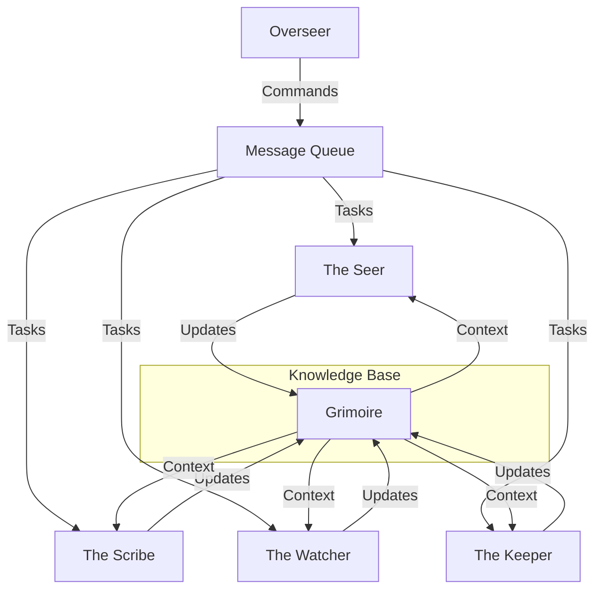
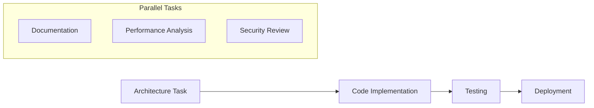
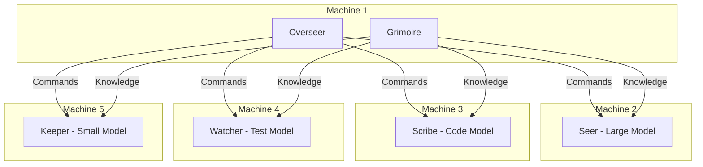

# The Circle Architecture

## Communication Patterns



## Distributed Processing Model

### 1. Message Queue System
- Distributed message queue for async communication
- Priority system for urgent synchronous requests
- Message types:
  - Command (requires immediate response)
  - Task (can be processed asynchronously)
  - Update (status and progress)
  - Query (knowledge base requests)

### 2. Entity States
Each entity can be in one of these states:
- Available: Ready for new tasks
- Processing: Working on a task
- Waiting: Blocked on another entity
- Offline: Not currently accessible

### 3. Task Dependencies


### 4. Distributed LLM Configuration

Each entity can run on different machines with different LLM configurations:

| Entity | Recommended Model | Optimization |
|--------|------------------|--------------|
| Seer | Large context model | Context length |
| Scribe | Code-specialized model | Code completion |
| Watcher | Medium model | Testing focus |
| Keeper | Small model | Quick responses |

### 5. Synchronization Mechanisms

1. **Blocking Operations**
   - Architecture approval
   - Critical bug fixes
   - Deployment gates

2. **Non-Blocking Operations**
   - Documentation updates
   - Test execution
   - Code analysis
   - Repository maintenance

### 6. Network Topology



## Implementation Strategy

1. **Message Queue System**
```python
class CircleMessage:
    id: str
    type: MessageType  # Command/Task/Update/Query
    priority: int
    sender: str
    recipient: str
    content: dict
    requires_response: bool
    timeout: Optional[int]
```

2. **Entity Manager**
```python
class EntityManager:
    def schedule_task(self, task: Task) -> None:
        """Schedule a task considering dependencies"""
        
    def check_dependencies(self, task: Task) -> bool:
        """Check if all dependencies are met"""
        
    def notify_completion(self, task: Task) -> None:
        """Notify dependent tasks of completion"""
```

3. **State Management**
```python
class EntityState:
    def transition_to(self, new_state: State) -> None:
        """Handle state transitions"""
        
    def can_process(self, task: Task) -> bool:
        """Check if entity can process task"""
```
